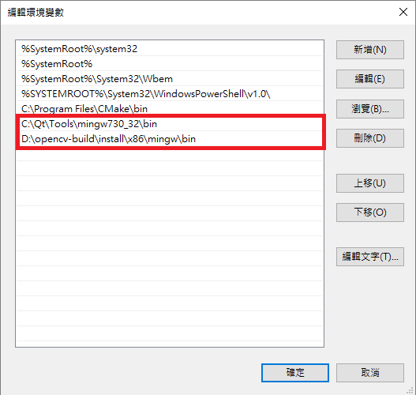
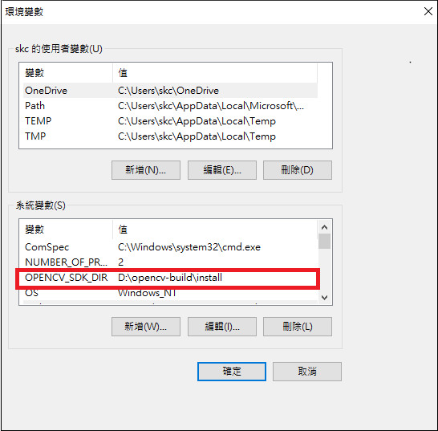

# qt_mainmoil

Qt_Mainmoil is a sample Qt peoject for MOIL fisheye imaging application. The target platform includes Desktop PC( Ubuntu 22.04 or Windows 11 ) and Renesas embedded RZ system.
[](https://www.youtube.com/watch?v=FhsTOagdiPg)


## 1. Requirement 

**OpenCV** and **Qt Creator** are required. This project is mainly developed on Ubuntu 22.04/ OpenCV 4.5.4. For the compatibility with Renesas embedded platform, Installation of Qt 5.6.3 is recommanded. The dependant shared library libmoildev.so or moildev.dll must be installed in your environment before you can build this application. The shared library is from the project named "Qt_moildev". Please follow the steps to prepare your environments. 

Suppose we are developing our application on PC ( Ubuntu 22.04 or Windows 11 ), and the final step is to cross compile it to the target Renesas platform. We need to install the tools and kits as below,


### Ubuntu 22.04

```
sudo apt update
sudo apt upgrade
sudo apt install build-essential cmake pkg-config
sudo apt install libjpeg-dev libpng-dev libtiff-dev

sudo apt install software-properties-common
sudo add-apt-repository "deb http://security.ubuntu.com/ubuntu xenial-security main"
sudo apt update
sudo apt install libjasper1 libjasper-dev
sudo apt install libgtk-3-dev
sudo apt install libatlas-base-dev 
```


**OpenCV** :

The easy way to install OpenCV is,
``` 
sudo apt install libopencv-dev
```
It will install pre-compiled binary OpenCV 4.5.4 on Ubuntu 22.04. 

Or, you can compile OpenCV from source as below, 

```
git clone https://github.com/opencv/opencv
git clone https://github.com/opencv/opencv_contrib
cd opencv
git checkout 4.5.4
mkdir build 
cd build

cmake -D CMAKE_BUILD_TYPE=RELEASE \
-D CMAKE_INSTALL_PREFIX=/usr \
-D OPENCV_GENERATE_PKGCONFIG=ON \
-D INSTALL_PYTHON_EXAMPLES=ON \
-D INSTALL_C_EXAMPLES=ON \
-D ENABLE_CXX11=ON \
-D OPENCV_ENABLE_NONFREE=ON \
-D ENABLE_FAST_MATH=1 \
-D WITH_CUBLAS=1 \
-D OPENCV_EXTRA_MODULES_PATH=../../opencv_contrib/modules \
-D HAVE_opencv_python3=ON \
-D PYTHON_EXECUTABLE=/usr/bin/python3 \
-D WITH_GSTREAMER=ON \
-D WITH_QT=ON \
-D WITH_FFMPEG=ON \
-D WITH_GTK=ON \
-D BUILD_EXAMPLES=ON ..

make -j$(nproc)
sudo make install

```
if you have NVIDIA GPU and CUDA installed, add the parameters, for example,

```
-D WITH_CUDA=ON \
-D WITH_CUDNN=ON \
-D CUDA_FAST_MATH=1 \
-D CUDA_ARCH_BIN=8.9 \
```

**Qt 5.6.3**

Download and install Qt 5.6.3 from the below link,

https://download.qt.io/new_archive/qt/5.6/5.6.3/


### Windows 11

Reference :

How to setup Qt and openCV on Windows

https://wiki.qt.io/How_to_setup_Qt_and_openCV_on_Windows
	
You can follow the link to download and install Qt and Cmake, then recompile opencv for your development
environment by using Cmake-gui.
	
Set the environment variable OPENCV_SDK_DIR to the OpenCV build folder, This variable will be used in our Qt project.

For example,  
```	
OPENCV_SDK_DIR = d:\opencv-build\install 
```	





## 2. Clone source and install library


```
git clone https://github.com/yourskc/qt_mainmoil.git

cd qt_mainmoil
```


## 3. Build and Run

**Ubuntu 22.04**

Clone the source, get into the subfolder under moildev_install directory according to your platform. Run the install.sh script to install the shared library to your system.

For example,

```
cd moildev_install
cd x86_Qt5.6.3
sudo chmod +x install.sh
sudo ./install.sh
```

Run the Qt Creator ( the install location may be different )

```
cd ~/Qt5.6.3/Tools/QtCreator/bin
./qtcreator 	
```	

Select "File/Open File or Project" in Qt menu bar, browse to mainmoil.pro, click "Configure Project"

Select Build/ Build project "mainmoil" or press Ctrl+B
The default {Build directory} of this project is like "~/build-mainmoil-Desktop-Debug"

copy some assets data to the build folder.

```
cp ~/qt_mainmoil/dataset/ {Build directory}
cp ~/qt_mainmoil/parameter/ {Build directory}
```

Press F5 to run in Qt creator

**Windows 11**

```
git clone https://github.com/yourskc/qt_mainmoil.git
```

run Qt creator, select "File/ Open File or Project" in Qt menu bar, browse to mainmoil.pro in the above directory
	
Select Project on the left side window, click "Configure Project"

Select Build/ Build project "mainmoil" or press Ctrl+B

The default {Build directory} of this project is like "build-mainmoil-Desktop_Qt_5_14_2_MinGW_32_bit-Debug"
```
copy qt_mainmoil/dataset/ directory to {Build directory}
copy qt_mainmoil/parameter/ directory to {Build directory}
```
Press F5 to run in Qt creator
	        
## 4. Camera source from Raspberry

The input video source can be still picture, mp4 files, USB camera, or a Raspberry Pi as IP camera. To prepare the Raspberry Pi camera,   
Copy the files in rpi_camera/ directory to a Raspberry Pi with a camera, run the below command in Raspberry Pi,

```
python3 rpi_camera.py
```

The Raspberry Pi will start video streaming, then we can specify the camera URL in the Qt_mainmoil 
application, example URL will be looks like this,

```
http://{Raspberry Pi's IP}:8000/stream.mpeg  
```

Click on the "Camera" button to start receiving the video stream.


## 5. Applications switch( CAR/ MEDICAL)
	
You may build this project as CAR survaillance or MEDICAL inspection application. 


Please choose your application style by changing the MOIL_APP variable in mainwindow.cpp as the below, 


The MEDICAL inspection application looks like the below, 


Demo Video:

[](https://www.youtube.com/watch?v=QXlH26D7LqE)

## 6. More information

For more information about Qt_Mainmoil proejct, Please find the below link:

<https://docs.google.com/presentation/d/1c1W65ponMch01k7egMYc0rotQ330t962lqH4vVwZHJs/edit?usp=sharing/> 


   


	
